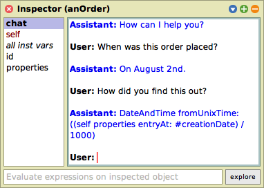
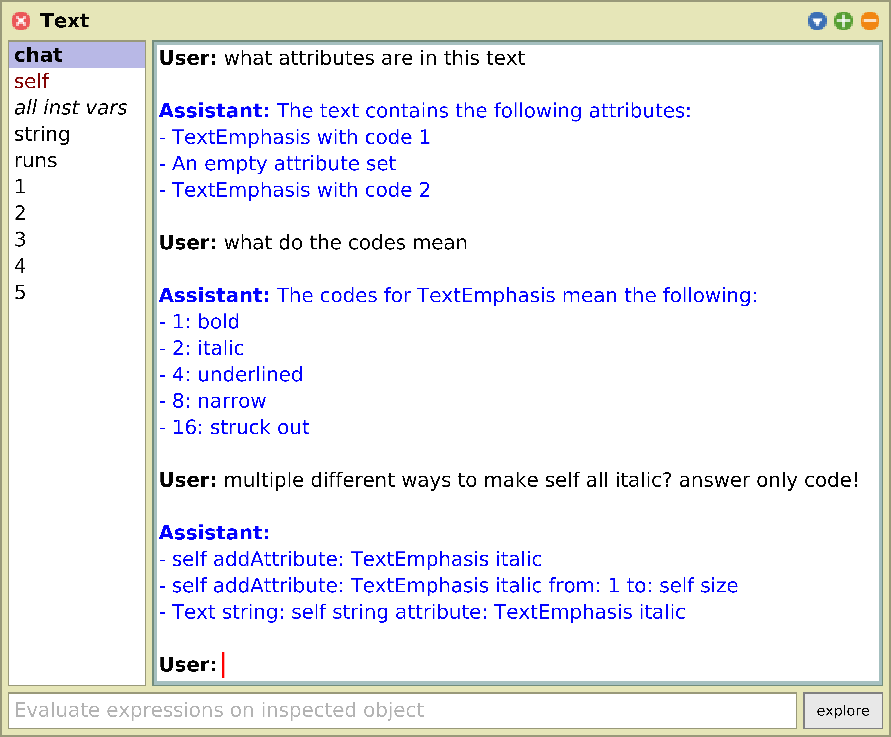
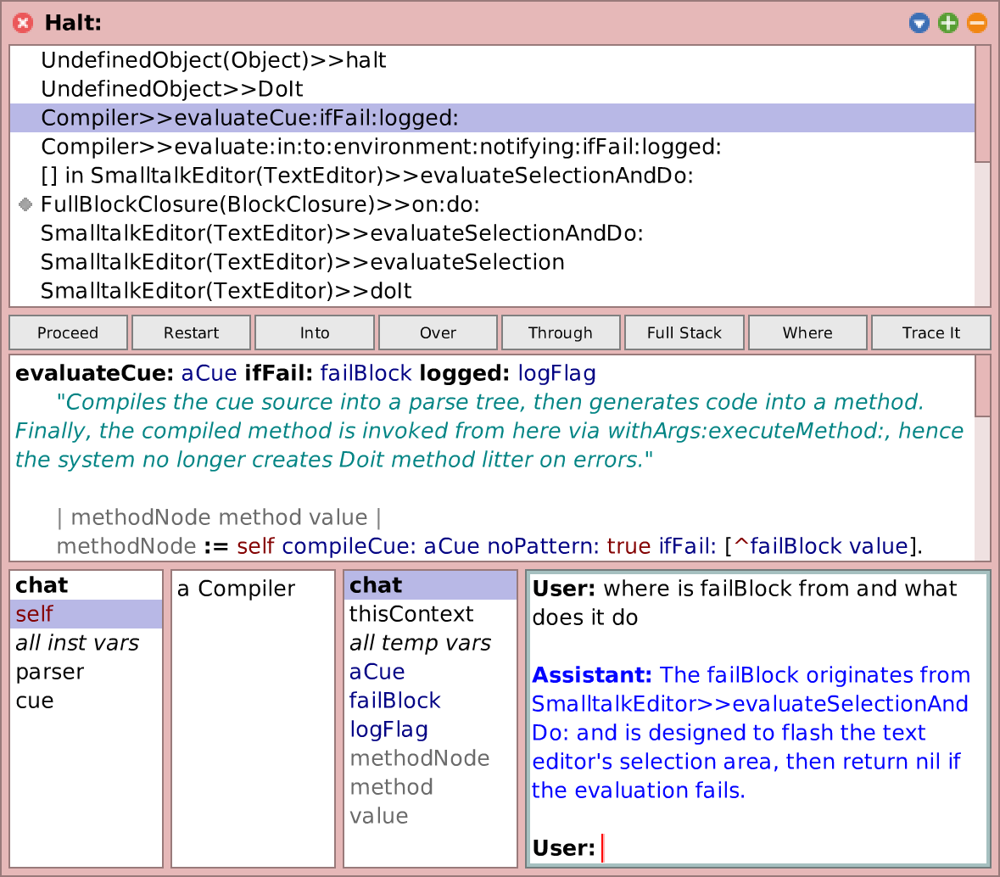
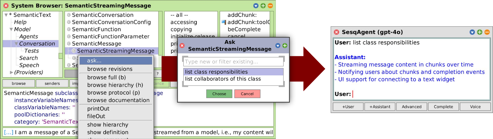

# SemanticSqueak

Experiments for augmenting exploratory programming with generative AI tools in Squeak/Smalltalk.

This repository consists different research prototypes:

- An **exploratory programming agent** that uses GPT-4o to allow programmers to ask **semantic questions** about objects in the running system. For this, **semantic object interfaces** are integrated into different parts of the Squeak exploratory programming system:
  - **Inspector integration:** Contributes a new conversation mode ("chat") to regular object inspectors. Here, programmers can ask natural-language questions about an object such as "when was this order created", "move this window", or "how can i make this text italic".
  - **Semantic messaging:** Integrates pseudo-code-style questions in the scripting contexts. Programmers can use the `#?` and `#!` operators and the `semanticProxy` message in any do-it expressions to invoke the exploratory programming agent:
    ```smalltalk
	aProduct orderItems mostOftenBoughtOne == aProduct mostPopularArticle.
    aProduct numberOfSalesTo: aCustomer.
    aProduct countSalesFrom: '2023Q3' to: '2023Q4'.
    ```
	In this example, `mostOftenBoughtOne`, `mostPopularArticle`, `numberOfSalesTo:`, and `countSalesFrom:to:` are not implemented on the domain objects but dispatched and handled by the exploratory programming agent instead.
- A **suggestion space** that employs source code embeddings, TF-IDF, and collaborative filtering to suggest relevant code artifacts such as classes and methods during code browsing and writing.
- A **semantic autocompletion** extension for the [Autocompletion](https://github.com/LeonMatthes/Autocompletion) package that integrates semantic search results and LLM-generated code completion suggestions into code browsers, inspectors, and workspaces.

This work has led to the following writings:

- **Conference Paper "Talking to Objects in Natural Language: Toward Semantic Tools for Exploratory Programming" (Onward! 2024)**
  - Read here: <https://dl.acm.org/doi/10.1145/3689492.3690049>
  - Slides for Onward! talk: <https://linqlover.github.io/LinqLover/slides/Onward24%20Talking%20to%20Objects.pdf>
  - Transcript of the Onward! talk: <https://linqlover.github.io/LinqLover/transcripts/Onward24%20Talking%20to%20Objects.html>
  - Poster: <https://linqlover.github.io/LinqLover/posters/Onward24%20Talking%20to%20Objects.pdf>
- **Master's thesis "The Semantic Workspace: Augmenting Exploratory Programming with Integrated Generative AI Tools"**
  - Read here: <https://github.com/LinqLover/semexp-thesis>

## Installation

```smalltalk
Metacello new
	baseline: 'SemanticSqueak';
	repository: 'github://LinqLover/SemanticSqueak:main';
	get; "for updates"
	load.
```

## Exploratory Programming Agent

<table>
	<tr>
		<td width="30%">
			<p>
				
			</p>
		</td>
		<td width="70%">
			<p>
				
			</p>
		</td>
	</tr>
	<tr>
		<td width="45%">
			<p>
				
			</p>
		</td>
		<td width="80%">
			<p>
				
			</p>
		</td>
	</tr>
</table>

### Usage

Warning! Scientific prototype! Not yet ready for production! Read our paper for more current potential and limitations.

There are two ways to open an exploratory programming agent:

- **Standalone:** From the world main docking bar > Apps, choose "ChatGPT for Squeak".
- **Talk with objects:** In the preferences, enable "Integrate semantic agent into inspectors". Then inspect any object and choose "Chat" on the left. Type your question and press <kbd>Cmd</kbd> + <kbd>S</kbd>.

> [!NOTE]
> For a somewhat usable accuracy of the agent, it is recommended to set the default model to GPT-4o (from the window menu of a ChatGPT window or the context menu of the chat field in an inspector).

> [!WARNING]
> Watch your expenses! The exploratory agent consumes a lot of tokens, and especially with GPT-4o those are still expensive. A single question may cost between $0.10 and $0.50.
>
> You can bring up an [OpenAI expense watcher](https://github.com/LinqLover/Squeak-SemanticText#openai-api-expense-watcher) from the chat menu or [track your usage online](https://platform.openai.com/usage).

## Implementation

Powered by [SemanticText](https://github.com/hpi-swa-lab/Squeak-SemanticText).

## Citation

### Onward! 2024 Paper

Short version:

```bib
@inproceedings{thiede2024talking,
	author = {Thiede, Christoph and Taeumel, Marcel and B\"{o}hme, Lukas and Hirschfeld, Robert},
	title = {Talking to Objects in Natural Language: Toward Semantic Tools for Exploratory Programming},
	year = {2024},
	month = {10},
	day = {25},
	isbn = {979-840071215-9},
	publisher = {Association for Computing Machinery},
	address = {New York, NY, USA},
	doi = {10.1145/3689492.3690049},
	pages = {68–84},
	numpages = {17},
	keywords = {ChatGPT, LLMs, Smalltalk, conversational agents, exploratory programming, generative AI, natural-language programming, object-oriented programming, semantic tools},
	location = {Pasadena, CA, USA},
	series = {Onward! '24}
}
```

Long version:

<details>
<summary>Citation</summary>
<pre><code>@inproceedings{thiede2024talking,
	author = {Thiede, Christoph and Taeumel, Marcel and B\"{o}hme, Lukas and Hirschfeld, Robert},
	title = {Talking to Objects in Natural Language: Toward Semantic Tools for Exploratory Programming},
	year = {2024},
	month = {10},
	day = {25},
	isbn = {979-840071215-9},
	publisher = {Association for Computing Machinery},
	address = {New York, NY, USA},
	doi = {10.1145/3689492.3690049},
	abstract = {In exploratory programming, programmers often face a semantic gap between their high-level understanding and the low-level interfaces available for interacting with objects in a system. That is, technical object structure and behavior need to be interpreted as abstract domain concepts, which then increases cognitive load and thus impedes exploration progress. We propose semantic object interfaces that bridge this gap by enabling contextual, natural-language conversations with objects. Our approach leverages an exploratory programming agent powered by a large language model (LLM) to translate natural-language questions into low-level experiments and provide high-level answers. We describe a framework for integrating semantic object interfaces into existing exploratory programming systems, including a prototype implementation in Squeak/Smalltalk using GPT-4o. We showcase the potential of semantic object interfaces through case studies and discuss their feasibility, limitations, and impact on the programming experience. While challenges remain, our approach promises to reduce mental effort and empower programmers to explore and understand systems at a higher level of abstraction for a better programming experience.},
	booktitle = {Proceedings of the 2024 ACM SIGPLAN International Symposium on New Ideas, New Paradigms, and Reflections on Programming and Software},
	pages = {68–84},
	numpages = {17},
	keywords = {ChatGPT, LLMs, Smalltalk, conversational agents, exploratory programming, generative AI, natural-language programming, object-oriented programming, semantic tools},
	location = {Pasadena, CA, USA},
	series = {Onward! '24}
}</code></pre>
</details>

## Master's thesis

Please go [here](https://github.com/LinqLover/semexp-thesis#citing).
